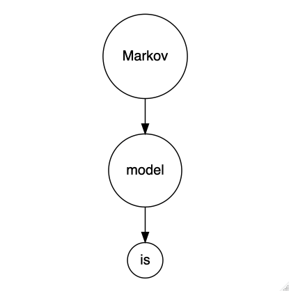

```{r setup, include = FALSE}
knitr::opts_chunk$set(echo = FALSE, 
                      comment = NA, 
                      warning = FALSE, 
                      message = FALSE, 
                      fig.pos = 'H', 
                      fig.align = 'center', 
                      fig.height = 3, 
                      fig.width = 6, 
                      fig.dpi = 300)
options(xtable.comment = FALSE, 
        xtable.table.placement = 'H')
import::from(magrittr, `%>%`)
library(readr)
library(stringr)
library(ggplot2)
library(plyr)
library(psych)
library(DiagrammeR)
library(pipeR)
library(V8)
set.seed(123)
```
# Data

We used the first book from the howework 1. first of all, we substracted the contents from the book and then split into single words, which looks like: 
```{r}
## read data 
## one book from the books used in homework 1
#dat = read_file("/Users/yuanyuanluan/Box/Fall2019/Statitical_Computing/HomeWork/HW1/data/books/books/98-0.txt")
dat = read_file("books/98-0.txt")

## Only use the contents of the book, which excludes things like introducntion part of the book. 
contents = regmatches(dat,gregexpr("(I. The Period).+",dat))[[1]]
#contents
## split into individual word
words = strsplit(contents, "[[:space:]]")[[1]]
words = unlist(strsplit(words,"(-)+")) # get ride of words like "shop-window"
head(words)

```

Then we deleted all non-characters words from the data and capitalized all the words. After that, we find all the roman numbers and delete them. As the end, we delete all the empty strings that were created during the data cleaning process. We ended up with over $9,000$ words look like: 
```{r}
## deleting all non-characters. 
rg = "\\W"
words.clean = laply(words, function(s){
  logic = grepl(rg, s)
  if(logic){
    word = gsub(rg, "", s)
  }
  else {
    word = s
  }
  return(word)
})


## convert all characters to capital cases and remove the roman letter "I"
words.clean = toupper(words.clean)[-1]


## Delete all the Roman Numbers
rg = "^M{0,4}(CM|CD|D?C{0,3})(XC|XL|L?X{0,3})(IX|IV|VI{0,3}|I{2,3})$"
words.clean = laply(words.clean, function(s){
  logic = grepl(rg, s)
  if(logic){
    word = gsub(rg, "", s)
  }
  else {
    word = s
  }
  return(word)
})

words.clean = words.clean[-which(sapply(words.clean,function(s){
  nchar(s) == 0
}))]
head(words.clean)
```

# Model 
Given the property of Markov chains that the probabiliy of future states depends only on the cunrrent states, but not the sequence of previous states.The `Markov Models for Language` we built here is based on this property, which means what the next word is only depends on the what the present words is and so on. 


For example, in the sentence "Markov model is a bit tedious but it is also a great model", `Markov` comes with `model` right after it which is then followed by the word `is` and so on. 


```{r}
## to generate the flow chart
grViz("digraph flowchart{
      # node definitions with substituted label text
      node [fontname = Helvetica, shape = circle]        
      tab1 [label = '@@1']
      tab2 [label = '@@2']
      tab3 [label = '@@3']
  
  # edge definitions with the node IDs
      tab1 -> tab2 -> tab3 
}
  [1]:'Markov'
  [2]:'model'
  [3]:'is'
") 
```


To buid this Markov chain with the first book for homework one, we first declared an empty list to store the result. Then, we iterate over all the words. We used all the unique words as the names of vectors in the list and every word that comes next to the unique words as the elements of the vector. For example, word `I` as the unique word, every word that comes next to every `I` will be the elements of the vector named `I`. 

The first 6 elements in the vector for the firt unique word in our model looks like: 
```{r}
words.unique = unique(words.clean)

#length(words.unique)

# MML = llply(words.unique, function(data){
#   pos = which(sapply(words.clean, function(s){
#                 s == data}))
#   MML = words.clean[pos+1]
#   return(MML)
# },.parallel = TRUE)
# 
# names(MML) = words.unique
# 

MML = list()
for (i in 1: (length(words.clean)-1)){
  w = words.clean[i]
  if(w %in% names(MML)){
    MML[[w]] = c(MML[[w]], words.clean[i+1])
  }else{
    MML[[w]] = c(words.clean[i+1])
  }
}

head(MML[[1]])

```
The name of this vector in the list is 
```{r}
names(MML)[1]
```
This means in the vector named "THE", we have all the words that come after "THE" in the book named "A Tale of Two Cities".


# Output 
Once we have the distribution of all the words, we can generate a sequence of words given a start word and the length of the sequence. Here we used the "I" as the start word and limited the number of words in the sequence to be 10. Here are the sequence of words generated: 

```{r}
## output test
#' @param start_word (character): The start word used to generate the sentence.
#' @param length_of_sequence (numeric): The number of words in the generated sentence.
#' @param dist (list): The list that contains the distribution of all the words. 
sentence_generator = function(start_word, length_of_sequence, dist){
  sentence = start_word
  for(i in 1:length_of_sequence){
  index = dist[[which(names(dist) == start_word)]]
  num_range = length(index)
  random_num = sample(seq(num_range),1)
  next_word = index[random_num]
  sentence = paste(sentence, next_word, sep = ' ')
  start_word = next_word
}
return(sentence)
}
sentence_generator("I", 10, MML)
```


